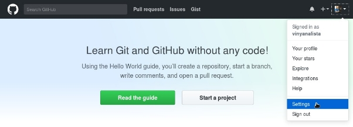
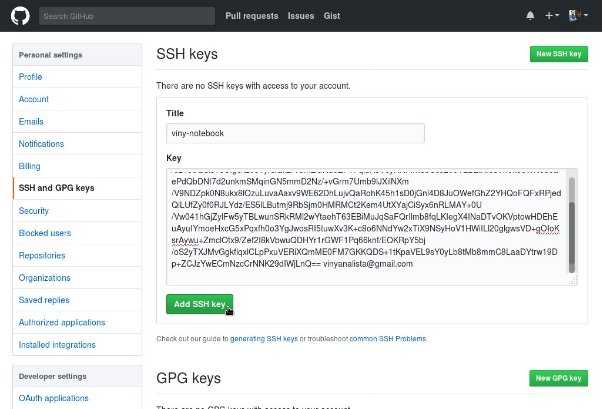
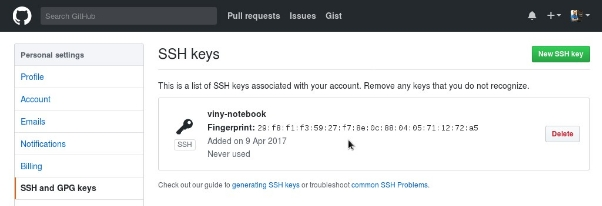

**Build process automation document** 

**After flashing new ubuntu image on pi below steps to follow to run automated build** 

**We need to establish connection between Linux image and git hub actions in order to clone GitHub repos to Linux machine we use ssh password less authentication** 

**To enable ssh password less authentication we need to following steps:**

**1.To generate a new SSH key pair, run the following command (replace your\_email@example.com with your email address):**

**ssh-keygen -t rsa -b 4096 -C “<your_email@example.com>”**

**Press** Enter **to accept the default location.**

**2.Add your SSH private key to the ssh-agent:**

**ssh-add ~/.ssh/id\_rsa**

**3.Start by copying your public SSH key (~/.ssh/id\_rsa.pub) file contents**
###
### **GitHub**

**Using a browser, go to the GitHub home page at [github.com](https://github.com/) and sign in to your account.**

**In the upper-right corner of the page, click your profile photo, then click** Settings**:**

**In the user settings sidebar, click** SSH and GPG keys**. Then click** New SSH key**.**

**Fill in the** Title **field with a descriptive label for the new key (for example, the name of your computer) and paste your public key into the** Key **field. Finally, click** Add SSH key**:**

Now the key appears in the list of SSH keys associated with your account:

|||
| :- | :- |

**Once Above steps are executed successfully, clone below repo for automated scripts**

**Git clone [git@github.com:Srinivasan-78/auto_scripts.git**](mailto:git@github.com:Srinivasan-78/auto_scripts.git)**

**Go to /home/ubuntu/auto scripts folder and run bash ./autostart.sh file**

**Autostart.sh file executes multiple scripts in below model as part of build** 

FILE=/home/ubuntu/flag.txt

if test -f "$FILE"; then

bash ./docker\_perms.sh && 

sudo bash ./docker\_Setup.sh &&

bash ./building\_Apps.sh

rm flag.txt

bash ./remove\_scripts.sh

bash ./dd.sh v\_latest

else

bash ./move\_to\_root.sh          à **Moves all files from auto\_scripts folder to /home/ubuntu**

cd /home/ubuntu

sudo bash ./kernal\_patch.sh    à **System goes for reboot post reboot need to re-start script** 

sudo bash ./dependencies.sh

bash ./test\_harness.sh &&

bash ./connectedhomeip.sh &&

sudo bash ./config.sh

touch flag.txt

sudo reboot                            à **System goes for reboot post reboot need to re-start script** 

fi

Note: we require restart auto\_start.sh file from /home/ubuntu folder since we are moving all files to /home/ubuntu location

